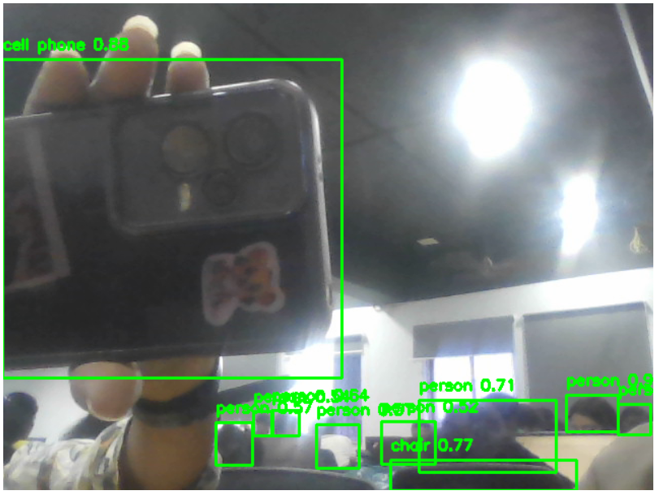

# WORKSHOP-2--Object-detection-using-web-camera
## Aim

To perform real-time object detection using the YOLOv4 algorithm and OpenCV through a webcam feed.

---

## Software Required

* Python
* OpenCV Library
* NumPy
* Matplotlib
* YOLOv4 Configuration File (`yolov4.cfg`)
* YOLOv4 Weights File (`yolov4.weights`)
* COCO Class Names File (`coco.names`)
* Jupyter Notebook / Google Colab

---

## Algorithm

1. Import the required libraries such as OpenCV, NumPy, and Matplotlib.
2. Load the YOLOv4 model using the configuration and weights files.
3. Load the COCO class names for object identification.
4. Access the webcam using OpenCV’s `VideoCapture()` function.
5. Capture video frames continuously from the webcam.
6. Convert each frame into a blob format suitable for YOLO processing.
7. Pass the blob through the YOLO network to detect objects.
8. Extract detected object information such as class labels, confidence scores, and bounding boxes.
9. Draw rectangles and labels around detected objects in the frame.
10. Display the processed output frame with detected objects in real time.
11. Stop the detection process when the user exits the program.

---

## Program:

```py

import cv2
import numpy as np
from IPython.display import display, clear_output
from PIL import Image

# Load YOLOv4
net = cv2.dnn.readNet("yolov4.weights", "yolov4.cfg")
with open("coco.names", "r") as f:
    classes = [line.strip() for line in f.readlines()]

layer_names = net.getLayerNames()
output_layers = [layer_names[i - 1] for i in net.getUnconnectedOutLayers().flatten()]

cap = cv2.VideoCapture(0)
if not cap.isOpened():
    print("Error: Could not open webcam.")
    exit()

try:
    while True:
        ret, frame = cap.read()
        if not ret:
            continue
        
        height, width, _ = frame.shape

        blob = cv2.dnn.blobFromImage(frame, 1/255.0, (416, 416), swapRB=True, crop=False)
        net.setInput(blob)
        outputs = net.forward(output_layers)

        boxes, confidences, class_ids = [], [], []

        for output in outputs:
            for detection in output:
                scores = detection[5:]
                class_id = np.argmax(scores)
                confidence = scores[class_id]
                if confidence > 0.5:
                    center_x = int(detection[0] * width)
                    center_y = int(detection[1] * height)
                    w = int(detection[2] * width)
                    h = int(detection[3] * height)
                    x = int(center_x - w/2)
                    y = int(center_y - h/2)

                    boxes.append([x, y, w, h])
                    confidences.append(float(confidence))
                    class_ids.append(class_id)

        indexes = cv2.dnn.NMSBoxes(boxes, confidences, 0.5, 0.4)

        if len(indexes) > 0:
            for i in indexes.flatten():
                x, y, w, h = boxes[i]
                label = classes[class_ids[i]]
                confidence = confidences[i]
                color = (0, 255, 0)
                cv2.rectangle(frame, (x, y), (x+w, y+h), color, 2)
                cv2.putText(frame, f"{label} {confidence:.2f}", (x, y-10), cv2.FONT_HERSHEY_SIMPLEX, 0.5, color, 2)

        # Display in notebook
        frame_rgb = cv2.cvtColor(frame, cv2.COLOR_BGR2RGB)
        display(Image.fromarray(frame_rgb))
        clear_output(wait=True)

except KeyboardInterrupt:
    print("Stopped by user.")

finally:
    cap.release()
    print("Webcam released.")


import matplotlib.pyplot as plt
import cv2

image = cv2.imread("snap.png")  
image_rgb = cv2.cvtColor(image, cv2.COLOR_BGR2RGB)

plt.imshow(image_rgb)
plt.axis('off') 
plt.show()

```
## Output:




## Result

The YOLOv4 object detection model successfully detected and identified objects from the webcam feed in real time. The detected objects were highlighted with bounding boxes and labels, demonstrating effective real-time object detection using OpenCV and YOLOv4.
